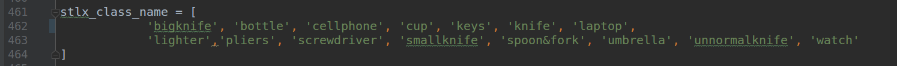

# CenterNet使用手册

# 一、配置运行环境

## 系统环境

Ubuntu16.04+CUDA10.0+Anaconda3.0

## 1.创建虚拟环境

conda create --name CenterNet python=3.6

## 2.安装pytorch

CUDA10需要安装1.x版本的pytorch，故：

conda install pytorch=1.3.1 torchvision -c pytorch

## 3.安装COCOAPI

git clone https://github.com/cocodataset/cocoapi.git $COCOAPI
cd $COCOAPI/PythonAPI
make
python setup.py install --user

## 4.安装依赖

CenterNet_ROOT=/path/to/clone/CenterNet

git clone https://github.com/xingyizhou/CenterNet $CenterNet_ROOT

pip install -r requirements.txt

## 5.编译DCNv2

git clone https://github.com/CharlesShang/DCNv2

将该DCNv2文件夹替换CenterNet\src\lib\models\networks\DCNv2文件夹

修改文件DCN2\src\cuda\dcn_v2_cuda.cu

cd CenterNet\src\lib\models\networks\DCNv2  

make.sh

## 6.编译NMS

cd CenterNet\src\lib\external

注释setup.py文件中该行代码

python setup.py build_ext --inplace

## 7.测试

python demo.py ctdet --demo ../images/ --load_model ../models/ctdet_coco_dla_2x.pth

# 二、应用

## 1.修改基本配置

（1）数据集准备：在CenterNet/data/下建立放自己数据集的文件夹（名称自取），将所有的图片和对应的xml文件分别放到两个文件夹中，利用xml_to_json脚本生成三个json文件train.json，test.json，val.json并放入指定位置

（2）在src/lib/datasets/dataset下新建一个python文件，复制coco.py的内容到新建py文件中进行修改。

按顺序为：修改类名为自定义名称；修改类别数量；图片的均值和标准差（利用脚本计算）；修改super类的继承改为自己定义的类名；修改data路径；依次修改val.json，test.json，train.json文件路径；修改类别名称和id

（3）将数据集加入src/lib/datasets/dataset_factory.py中

（4）修改src/lib/opts.py中的默认数据集为自己的数据集；在340行左右的地方修改ctdet任务的默认配置为自己数据集的相关数据项

（5）修改src/lib/utils/debugger.py文件，45行左右添加自己数据集的类别数和名称；在下面450行添加类别对应列表

## 2.训练

执行python  src/main.py开始训练

可用配置项：

（1）--batch_size：一次迭代中得样本数目

（2）--lr：学习率

（3）--gpus：使用的gpu设备id，可用多个gpu（--gpus 0,1）

（4）--load_model：加载预训练模型

（5）--reume：从model_last.pth恢复训练

## 3.测试

python src/test.py {path_to_pth_file}

