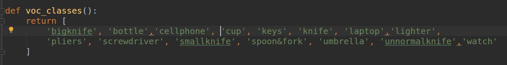
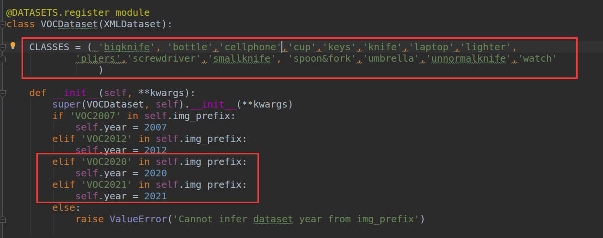
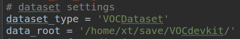
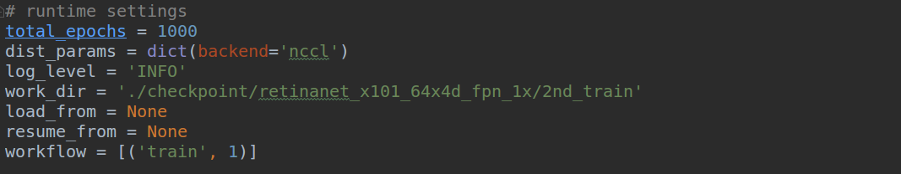

# MMDetection使用手册

# 一、配置运行环境

## 系统环境

Ubuntu16.04+CUDA10.0+Anaconda3.0

## 1.创建虚拟环境

conda create -n open-mmlab python=3.7

source activate open-mmlab

## 2.安装Cython

conda install Cython

## 3.安装mmcv

git clone https://github.com/open-mmlab/mmcv.git

cd mmcv

pip install .

## 4.安装pytorch

conda install pytorch torchvision cudatoolkit=10.0 -c pytorch

## 5.安装mmdetection

git clone https://github.com/open-mmlab/mmdetection.git

cd mmdetection

python setup.py build

python setup.py install

python setup.py develop

## 6.测试

(1).新建demo.py，导入需要的接口

from mmdet.apis import init_detector,inference_detector,show_result

(2).选择网络及权重

例：config_file = '/home/xt/mmdetection/configs/cascade_rcnn_r50_fpn_1x.py'

​       checkpoint_file = '/home/xt/mmdetection/work_dirs/cascade_rcnn_r50_fpn_1x/epoch_1.pth'

(3).构建模型

model = init_detector(config_file,checkpoint_file)

(4).测试并展示结果

result = inference_detector(model,img)

show_result(img,result,model.CLASSES)

# 二、应用

## 1.修改基本配置

（1）修改mmdetection/mmdet/core/evaluation/class_names.py中voc_classes里的类别为自己的训练类别

（2）修改mmdetection/mmdet/datasets/voc.py中的CLASSES为自己的训练类别并添加数据集名称

（3）修改模型配置文件，以mmdetection/configs/retina_x101_64x4d_fpn_1x.py为例

文件中搜索"num_classes"，将数值改为训练总类别+1

修改数据集类型和路径

修改每gpu处理的图片数和每gpu开启的线程数；修改数据集划分文件路径和图片路径

修改运行设置，包括：迭代次数、存储checkpoint的路径、是否加载预训练模型、是否继续训练

## 2.训练

运行：python mmdetection/tools/train.py  configs/retinanet_x101_64x4d_fpn_1x.py 开始训练

可用配置项：

（1）--gpus：使用gpu得数量

（2）--resume_from：接着某一checkpoint继续训练，通常用来恢复中断得训练任务

（2）--load_from：使用某一checkpoint进行训练，通常用来调优

## 3.测试

（1）输出.pkl文件：python tools/test.py configs/{config_file} checkpoint/{checkpoint_file} --out results.pkl

（2）计算mAP：python tools/voc_eval.py results.pkl configs/{config_file}

