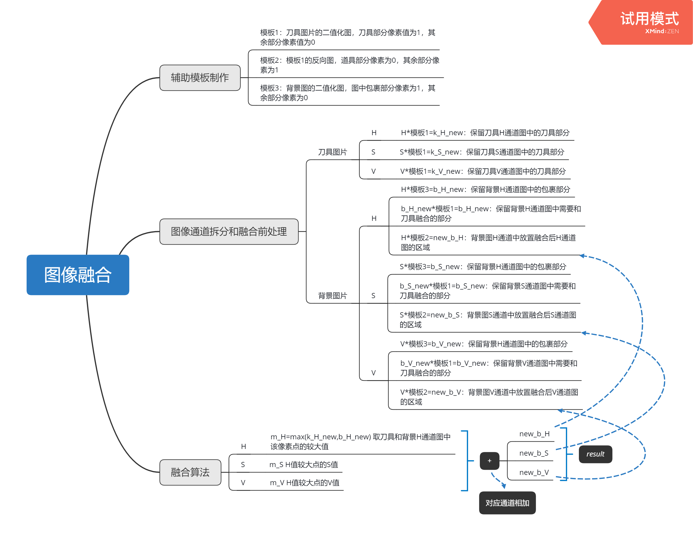
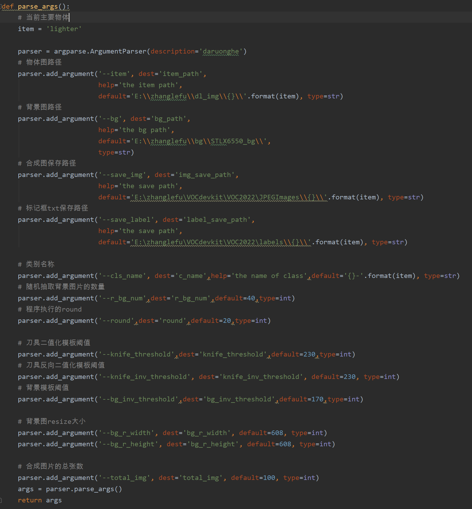

## 1.图像拆分算法

git链接：http://gitlab.stlx.com.cn:8088/free/procpic/tree/master/core%20algorithm

工程内容：

item_segmentation.py 拆分模块

item_fill.py 物体填充模块

item_mark.py 提取物体

main.py 主程序，运行入口

算法思路：

（1）突出蓝色物体（刀具或金属物）。将图像转换为HSV模式，利用蓝色阈值保留图像中的蓝色物品，筛掉其余物体；也可使用RGB图像，去掉蓝色通道即可突出蓝色物体。

（2）图像预处理：降噪，锐化，形态学处理等。

（3）利用外接轮廓面积，去掉较小物体。

（4）利用物体的灰度差异，尝试将重叠部分拆分，可借鉴分水岭算法。

（5）对于形状相对规则的物体，可使用霍夫直线检测先进行整体轮廓的补全，再将重叠部分的颜色分别赋予残缺部分。

实现效果：

## 2.图像融合程序

git链接：http://gitlab.stlx.com.cn:8088/free/procpic/tree/master/image_fusion

工程内容：

hsv_test.py 模板制作、图像融合

image_fusion_function.py 选取融合位置、坐标归一化

main.py 主程序，运行入口，各个通道间运算的过渡

整体流程：

（1）选取背景图和物体图。在背景图中找出放置物体的位置，在物体图中截出包含物体的最小矩形。

（2）图像融合：

（3）保存最小矩形的坐标作为标记框坐标，写入txt。

参数介绍：

## 3.智能识别平台

见[《智能采集终端（服务端）和识别评估系统交接文档》](http://gitlab.stlx.com.cn:8088/free/procpic/blob/master/交接资料/智能采集终端%EF%BC%88服务端%EF%BC%89和识别评估系统交接文档.md)及[《智能识别平台说明文档》](http://gitlab.stlx.com.cn:8088/free/procpic/blob/master/交接资料/智能识别平台说明文档.md)

## 4.样本管理系统

见[《样本管理系统设计文档》](http://gitlab.stlx.com.cn:8088/free/procpic/blob/master/交接资料/样本管理系统设计文档.md)