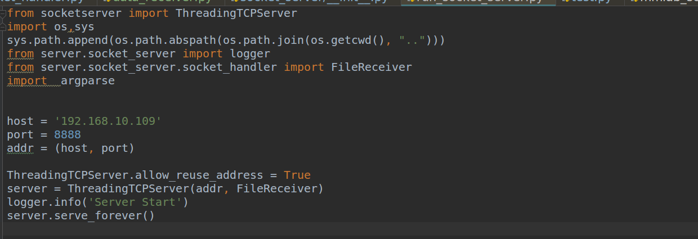

# 智能识别平台说明文档

注：本文档承接《智能采集终端（服务端）和识别评估系统交接文档》，将新增和变更内容记录其中。

# 一、平台基本信息

## 1.部署位置

192.168.10.109 /home/xt/rcnns/server

## 2.增加模块

（1）新增MMDetection识别模块，具体位置为：server/mmdetection/mmlab_server_api.py

（2）新增连接样本管理系统的接口模块

## 3.运行环境

使用anconda虚拟环境，使用 source activate tensorflow-cuda10激活环境后运行程序（依赖内容不变，只将系统的CUDA升级为CUDA10）

# 二、平台功能介绍

## 1.功能简介

（1）接收采集终端发送的图像和设备相关信息，选取相应的图像算法进行识别工作，并将最终结果返还给采集终端。

（2）接收样本管理系统发送的模型配置文件和样本集，利用配置文件初始化模型，使用该样本集进行测试，返回相应的测试结果。

## 2.程序入口

终端输入：python run_socket_server.py启动服务。

