# 深度学习模型维护文档

[TOC]

# 一、数据集

## （一）数据集存储路径

​                   主目录：/var/samps/

## （二）数据集概况

### 1.VOC数据集

#### （1）VOC2020

数据集路径：主目录+VOC2020/JPEGImages/

数据集内容：

| 类别名称（共16类）        | 单一物体图（单位：张） | 合成图（单位：张） | 总计  |
| ------------------------- | ---------------------- | ------------------ | ----- |
| bigknife（大刀）          | 5280                   | 3000               | 8280  |
| bottle（塑料瓶）          | 1176                   | 0                  | 588   |
| cellphone（手机）         | 456                    | 0                  | 456   |
| compressed-gas（压力罐）  | 35                     | 0                  | 35    |
| cup（杯子）               | 216                    | 3000               | 3216  |
| keys（钥匙）              | 420                    | 0                  | 420   |
| knife（普通刀具）         | 23676                  | 3000               | 26676 |
| laptop（笔记本电脑）      | 144                    | 0                  | 144   |
| lighter（打火机）         | 504                    | 0                  | 504   |
| pliers（钳子）            | 588                    | 3000               | 3588  |
| screwdriver（螺丝刀）     | 456                    | 0                  | 456   |
| smallknife（小刀）        | 28992                  | 3000               | 28992 |
| spoon&fork（餐勺&餐叉）   | 1488                   | 3000               | 3744  |
| umbrella（雨伞）          | 384                    | 0                  | 384   |
| unnormalknife（其他刀具） | 8952                   | 3000               | 11952 |
| watch（手表）             | 636                    | 0                  | 636   |
|                           | 72071                  | 21000              | 93071 |

数据集划分：

|        | 占比  | txt文件路径                                 |
| ------ | ----- | ------------------------------------------- |
| 测试集 | 10.3% | /var/samps/VOC2020/ImageSets/Main/test.txt  |
| 训练集 | 82.6% | /var/samps/VOC2020/ImageSets/Main/train.txt |
| 验证集 | 7.1%  | /var/samps/VOC2020/ImageSets/Main/val.txt   |

#### （2）VOC2021

数据集路径：主目录+VOC2021/JPEGImages/

数据集内容：

| 类别名称（共15类）        | 单一物体图（单位：张） | 合成图（单位：张） | 总计   |
| ------------------------- | ---------------------- | ------------------ | ------ |
| bigknife（大刀）          | 5280                   | 5000               | 10280  |
| bottle（塑料瓶）          | 588                    | 0                  | 588    |
| cellphone（手机）         | 456                    | 1000               | 1456   |
| cup（杯子）               | 216                    | 3000               | 3216   |
| keys（钥匙）              | 420                    | 1000               | 1420   |
| knife（普通刀具）         | 23676                  | 5000               | 28676  |
| laptop（笔记本电脑）      | 144                    | 1000               | 1144   |
| lighter（打火机）         | 504                    | 0                  | 504    |
| pliers（钳子）            | 588                    | 3000               | 3588   |
| screwdriver（螺丝刀）     | 456                    | 1000               | 1456   |
| smallknife（小刀）        | 28992                  | 3000               | 31992  |
| spoon&fork（餐勺&餐叉）   | 744                    | 3000               | 3744   |
| umbrella（雨伞）          | 384                    | 1000               | 1384   |
| unnormalknife（其他刀具） | 8952                   | 3000               | 11952  |
| watch（手表）             | 636                    | 1000               | 1636   |
|                           | 72036                  | 31000              | 103036 |

数据集划分：

|        | 占比  | txt文件路径                                 |
| ------ | ----- | ------------------------------------------- |
| 测试集 | 10.0% | /var/samps/VOC2021/ImageSets/Main/test.txt  |
| 训练集 | 80.0% | /var/samps/VOC2021/ImageSets/Main/train.txt |
| 验证集 | 10.0% | /var/samps/VOC2021/ImageSets/Main/val.txt   |

#### （3）VOC2007

数据集路径：主目录+VOCdevkit/VOC2007/JPEGImages/

数据集内容：

| 类别名称（共38类）          | 单一物体图（单位：张） | 合成图（单位：张） | 总计   |
| --------------------------- | ---------------------- | ------------------ | ------ |
| bigknife（大刀）            | 5280                   | 11484              | 16764  |
| bracelet（手镯）            |                        | 8608               |        |
| charging-treasure（充电宝） |                        | 2510               |        |
| compressed-gas（压力罐）    |                        | 1887               |        |
| cosmetics（化妆品）         |                        | 3624               |        |
| fireworks（烟花）           |                        | 3982               |        |
| gem（珠宝）                 |                        | 12627              |        |
| gun（枪）                   |                        | 12655              |        |
| knife（普通刀具）           | 23669                  | 52176              | 75845  |
| lighter（打火机）           |                        | 4491               |        |
| lizard（蜥蜴）              |                        | 3171               |        |
| mammals（哺乳动物）         |                        | 1403               |        |
| necklace（项链）            |                        | 8999               |        |
| plant（植物）               |                        | 11462              |        |
| poultry（家禽）             |                        | 673                |        |
| rifle（来福枪）             |                        | 7455               |        |
| shotguns（猎枪）            |                        | 6658               |        |
| smallknife（小刀）          | 28968                  | 19332              | 48300  |
| snake（蛇）                 |                        | 375                |        |
| tortoise（乌龟）            |                        | 1108               |        |
| unnormalknife（其他刀具）   |                        | 6549               |        |
| others（其他物品）          |                        | 19667              |        |
|                             | 57917                  | 200896             | 258813 |

说明：剩余类别(umbrella（雨伞）,pliers（钳子）,charger（电源）,cellphone（手机）,laptop（笔记本电脑）,watch（手表）,keys（钥匙）,fruits（水果）,cup（杯子）,book（书）,shoes（鞋子）,bottle（塑料瓶）,glassbos（眼镜盒）,screwdriver（螺丝刀）,spoon&fork（餐勺&餐叉）,bullet（子弹）,cigarette-lighter（打火机））没有单独创建文件夹，均包含在"others"中。

数据集划分：

|        | 占比  | txt文件路径                                           |
| ------ | ----- | ----------------------------------------------------- |
| 测试集 | 10.0% | /var/samps/VOCdevkit/VOC2007/ImageSets/Main/test.txt  |
| 训练集 | 80.1% | /var/samps/VOCdevkit/VOC2007/ImageSets/Main/train.txt |
| 验证集 | 9.9%  | /var/samps/VOCdevkit/VOC2007/ImageSets/Main/val.txt   |

### 2.COCO数据集

#### （1）stlx

数据集路径：主目录+stlx/images/

数据集内容：使用的图片和类别同VOC2021（15个类别，共103036张图片）

数据集划分：

|        | 占比  | json文件路径                           |
| ------ | ----- | -------------------------------------- |
| 测试集 | 10.0% | /var/samps/stlx/annotations/test.json  |
| 训练集 | 80.0% | /var/samps/stlx/annotations/train.json |
| 验证集 | 10.0% | /var/samps/stlx/annotations/val.json   |

# 二、模型

## （一）MMDetection

说明：模型均为基于MMDetection框架的模型

### 1.retinanet_x101_64x4d_fpn_1x

#### 部署位置：

192.168.10.109 /home/xt/mmdetection/

#### git链接：

http://gitlab.stlx.com.cn:8088/dev/mmdetection.git

#### 权重文件路径：

/home/xt/mmdetection/checkpoint/retinanet_x101_64x4d_fpn_1x/，共训练了3次，内涵pth文件和训练日志

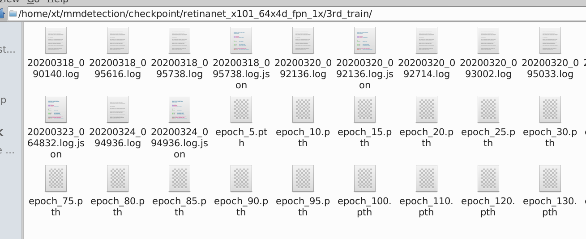

#### 运行说明：

（1）修改mmdetection/mmdet/core/evaluation/class_names.py中voc_classes里的类别为自己的训练类别

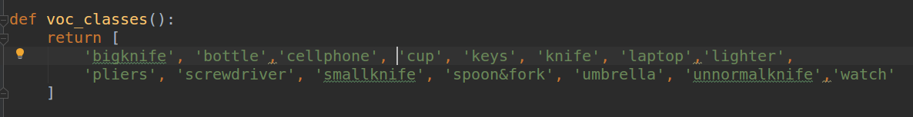

（2）修改mmdetection/mmdet/datasets/voc.py中的CLASSES为自己的训练类别并添加数据集名称

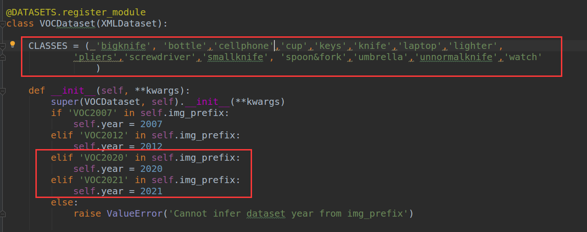

（3）修改模型配置文件，以mmdetection/configs/retina_x101_64x4d_fpn_1x.py为例

文件中搜索"num_classes"，将数值改为训练总类别+1

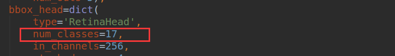

修改数据集类型和路径

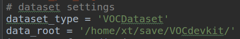

修改每gpu处理的图片数和每gpu开启的线程数；修改数据集划分文件路径和图片路径

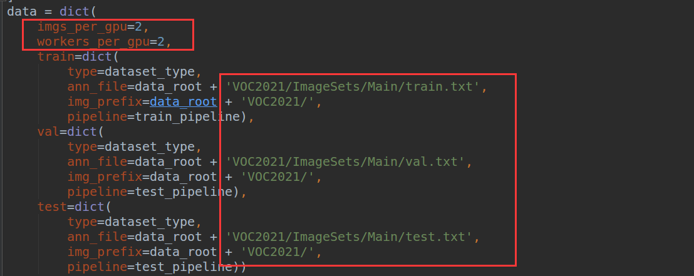

修改运行设置，包括：迭代次数、存储checkpoint的路径、是否加载预训练模型、是否继续训练

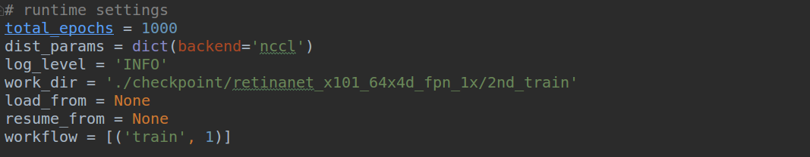

（4）运行：python mmdetection/tools/train.py  configs/retinanet_x101_64x4d_fpn_1x.py 开始训练

#### 模型跑分：

（1）运行配置：

使用样本集：VOC2021

检测时间（平均）：0.23s per image

训练时间（平均）：1.5s per batch_size(32 images)

（2）生成pkl文件：python  tools/test.py configs/retinanet_x101_64x4d_fpn_1x.py checkpoint/retinanet_x101_64x4d_fpn_1x/2nd_train/latest.pth  --out  result/retina101.pkl

（3）计算mAP值：python tools/voc_eval.py  result/retinanet101.pkl  configs/retinanet_x101_64x4d_fpn_1x.py

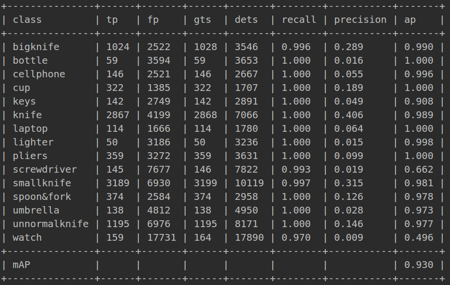

class：类别名称

tp：真正例（预测为真，实际为真）数量

fp：假正例（预测为真，实际为假）数量

gts：测试样本数量

dts：有检测结果的数量

recall：召回率（recall = tp/gts）

precision：查准率（precision = tp/dets）

### 2.cascade_rcnn_x101_64x4d_fpn_1x

#### 部署位置：

192.168.10.109 /home/xt/mmdetection/

#### git链接：

http://gitlab.stlx.com.cn:8088/dev/mmdetection.git

#### 权重文件路径：

/home/xt/mmdetection/checkpoint/cascade_rcnn_x101_64x4d_fpn_1x/，共训练了3次，内涵pth文件和训练日志

#### 模型跑分：

100epoch

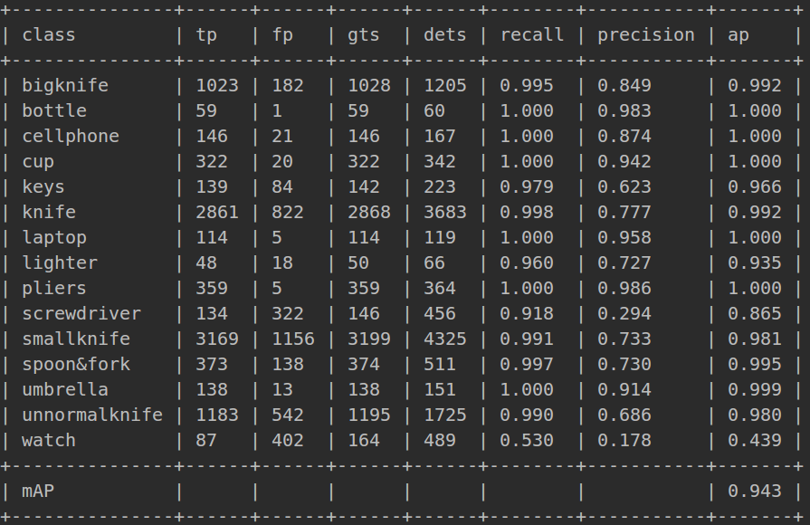

## （二）CenterNet

#### 部署位置：

192.168.10.109 /home/xt/project/CenterNet

#### git链接：

http://gitlab.stlx.com.cn:8088/dev/CenterNet.git

#### 权重文件路径：

/home/xt/project/CenterNet/exp/<训练次数>_train/ctdet/default/

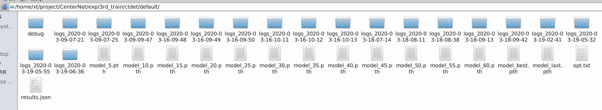

#### 运行说明：

（1）数据集准备：在CenterNet/data/下建立放自己数据集的文件夹（名称自取），将所有的图片和对应的xml文件分别放到两个文件夹中，利用xml_to_json脚本生成三个json文件train.json，test.json，val.json并放入指定位置

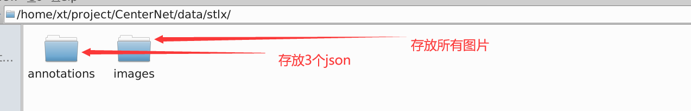

（2）在src/lib/datasets/dataset下新建一个python文件，复制coco.py的内容到新建py文件中进行修改。

按顺序为：修改类名为自定义名称；修改类别数量；图片的均值和标准差（利用脚本计算）；修改super类的继承改为自己定义的类名；修改data路径；依次修改val.json，test.json，train.json文件路径；修改类别名称和id

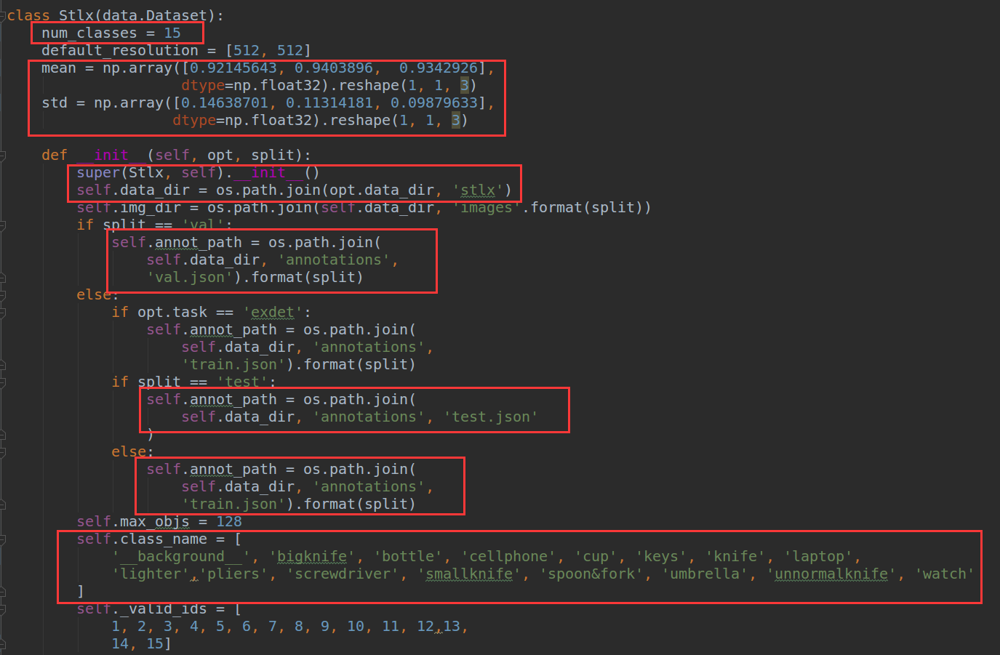

（3）将数据集加入src/lib/datasets/dataset_factory.py中

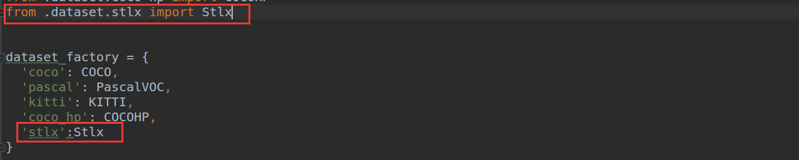

（4）修改src/lib/opts.py中的默认数据集为自己的数据集；在340行左右的地方修改ctdet任务的默认配置为自己数据集的相关数据项

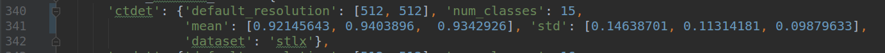

（5）修改src/lib/utils/debugger.py文件，45行左右添加自己数据集的类别数和名称；在下面450行添加类别对应列表

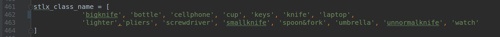

（6）执行python  src/main.py开始训练

#### 模型跑分：

## （三）YOLOv2

见[《深度学习模型交接文档（Faster和Yolo）》](http://gitlab.stlx.com.cn:8088/free/procpic/blob/master/交接资料/深度学习模型交接文档%EF%BC%88Faster和Yolo%EF%BC%89.md)

## （四）Faster-RCNN

见[《深度学习模型交接文档（Faster和Yolo）》](http://gitlab.stlx.com.cn:8088/free/procpic/blob/master/交接资料/深度学习模型交接文档%EF%BC%88Faster和Yolo%EF%BC%89.md)

